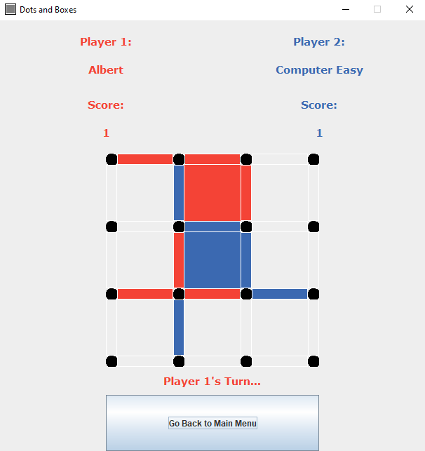

# dots_and_boxes

11/12/2020
Group created, first reunion. Talked about BankOCR

19/12/2020
Started focusing on the final project.
Three ideas have been proposed on the game's logical structure.

21/12/2020
New reunion. Discussion on pdf file Input/Output/Logical Units about program subdivision
A decision has been taken for the project structure.
26/12/2020
Alpha almost completed. Two proposals to complete the Game class are completed.
28/12/2020
Class Game becomes an abstract one;
Alpha completed of terminal game. Choice out of Nicola or Ivan's proposals. Merge done on Nicola's Branch.
Now programmers are free to develop extra features and add more tests to ensure functionality.

31/12/2020
Another discussion, tests were added for the alpha. Started to develop more extra features of the game in the previous days

02/01/2021
Set goals to complete the project including presentation and future refactoring

05/01/2021 
Found important code smell, code duplication and consequent shotgun surgery.

9/01/2021
Adapted some tests to the new configuration of the code, still need to delete dead code and refactor the whole project

12/01/2021
Worked together to continue the Server-Client version.
Adapted Main Menus for Gui and Terminal to call the various game modes

13/01/2021
Worked in pair programming to continue the Server-Client version.

## Rules

  1. Choose the players' identity and color, and the grid size;
  2. At each Player's turn, a line from the game grid must be selected;
  3. The player who completes a box gets a point and has an extra turn;
  4. Two players compete to complete most boxes in the game grid\sand to get more points!
  5. You can also choose to host or join a server-based game on the main menu.
                        
  ### Enjoy the game!

## Cli version
You can select which type of game to start from the menu.

The following is the representation of the board in the Command Line version.

To insert a line there are 3 parameters [*x*, *y*, *side*]:
- *x*,*y* are the coordinates of one of the two adjacent boxes composed by that line
- *side* = [U, R, L, R] is the position of the line with respect to that box: Up, Down, Left, Right.

## Gui version
From this menu you can select:
1. player1 name
2. player2 name if human, or the difficulty of the computer player
3. player colors
4. board dimensions
    1. Local: to play the game in your machine
    2. Host:  to start hosting a 3x3 board and wait for another player in LAN to join the game
    3. Join:  to join a hosted game by another user present in LAN, specifying his internal IP address.

Then press "Start Game!". 

To view a game demonstration press "Demo"

Once a game has started this window will pop up. To insert a line use your mouse. 
Check if it is your turn with the label under the grid.

