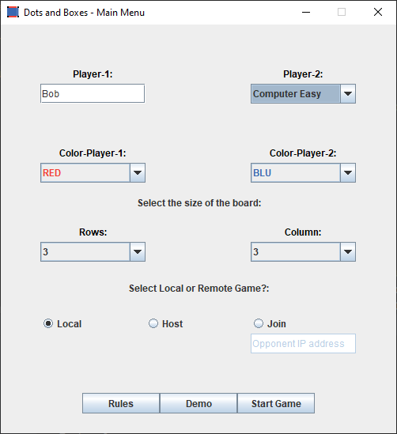

# Dots and Boxes

Dots and Boxes is a pencil-and-paper game for two players. It was first published in the 19th century by French mathematician Édouard Lucas, who called it la pipopipette. It has gone by many other names, including the game of dots, dot to dot grid, boxes, and pigs in a pen.

## Rules

  1. Choose the players' identity and color, and the grid size;
  2. At each Player's turn, a line from the game grid must be selected;
  3. The player who completes a box gets a point and has an extra turn;
  4. Two players compete to complete most boxes in the game grid\sand to get more points!
  5. You can also choose to host or join a server-based game on the main menu.
                        
  ### Enjoy the game!

## Cli version
You can insert which game mode you want to start from the main menu.

The following is the representation of the board in the Command Line version.

To insert a line there are 3 parameters [*x*, *y*, *side*]:
- *x*,*y* are the coordinates of one of the two adjacent boxes composed by that line
- *side* = [U, D, L, R] is the position of the line with respect to that box: Up, Down, Left, Right.

## Gui version
From this menu you can select:
1. Player-1 name
2. Player-2 name if human, or the difficulty of the computer player
3. Player colors
4. Board dimensions
5. Local: to play the game in your machine
6. Host:  to start hosting a 3x3 PvP game and wait for another player in LAN to join the game
7. Join:  to join a hosted PvP game by another user present in LAN, specifying his internal IP address.
8. "Demo" button to view a game demonstration

Then press "Start Game!". 

Once a game has started this window will pop up. 
Click on a line to play your turn. 
Check if it is your turn on the label under the grid.

### Developers

- [Luca Crozzoli](https://github.com/Luca-Crozzoli)
- [Ivan Zennaro](https://github.com/Ivan-Zennaro)
- [Nicola Domenis](http://github.com/nicdom23)
- [Stefano Pasquini](https://github.com/JawaCoder)
- [Dario Crosera](https://github.com/drocro)
